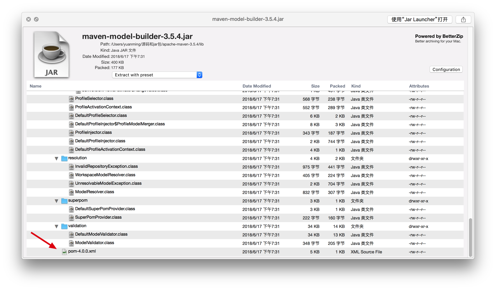
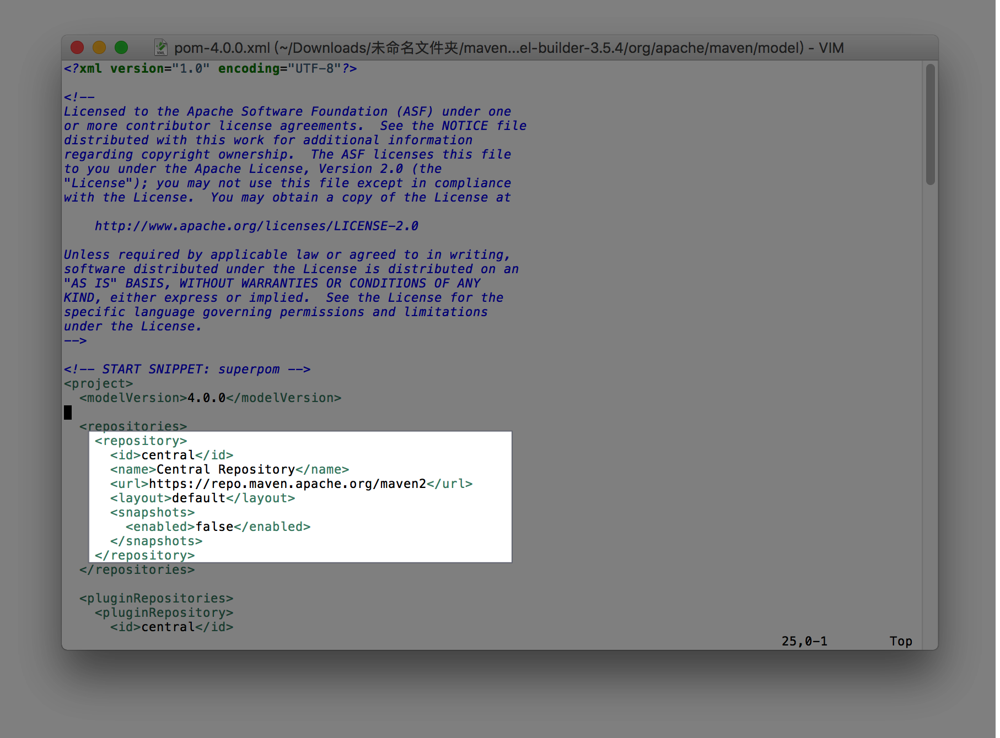

## maven常用构建命令
1. 查看maven版本：mvn -v
2. 编译：mvn compile
3. 打包：mvn package
4. 测试：mvn test
5. 删除target目录：mvn clean
6. 安装jar包到本地仓库：mvn install
7. 自动建立目录结构的两种方式：

* mvn archetype:generate 按指示输入信息
* mvn archetype:generate 
-DgroupId=网址+项目名 
-DartifactId=项目名-模块名
-Dversion=版本号 
-Dpackage=代码包名

## 构件、仓库、镜像仓库
1. 构件：pom.xml配置文件中的dependency，包含构件坐标
2. 仓库(repository)：本地仓库和远程仓库。先去本地仓库查询构件，如果没有就去远程仓库下载。
> maven提供了一个默认的全球中央仓库，在lib目录下jar包"maven-model-builder"中的pom-4.0.0.xml中配置了该仓库，所有项目的pom.xml都会继承该xml,默认就使用了该全球中央仓库

3. 镜像仓库：配置远程仓库的镜像，所有针对原仓库的访问将转到镜像仓库，原仓库的url设置无效。

* conf/settings.xml中配置镜像仓库。
* mirror的mirrorOf不能和任何一个mirror的id相同。
* mirrorOf配置的是该镜像所匹配的远程仓库(id)。拦截对应的远程仓库，使所有针对原仓库的访问将转到镜像仓库。

> 我配置了一个阿里云的mirror，mirrorOf配置的是central，则id是central的仓库将会转到阿里云的镜像下载构件，原仓库的url设置将失效。

* mirrorOf的值设置

